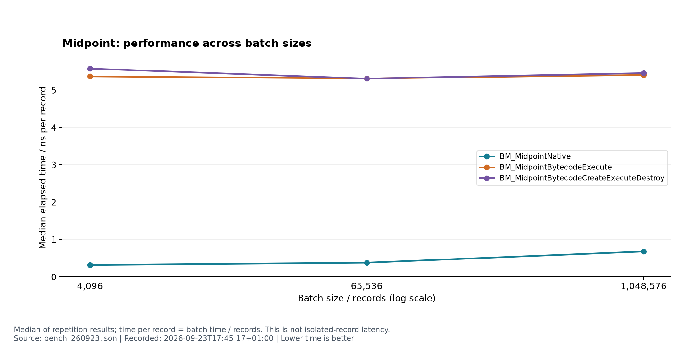
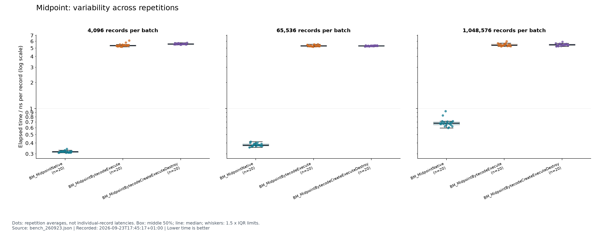
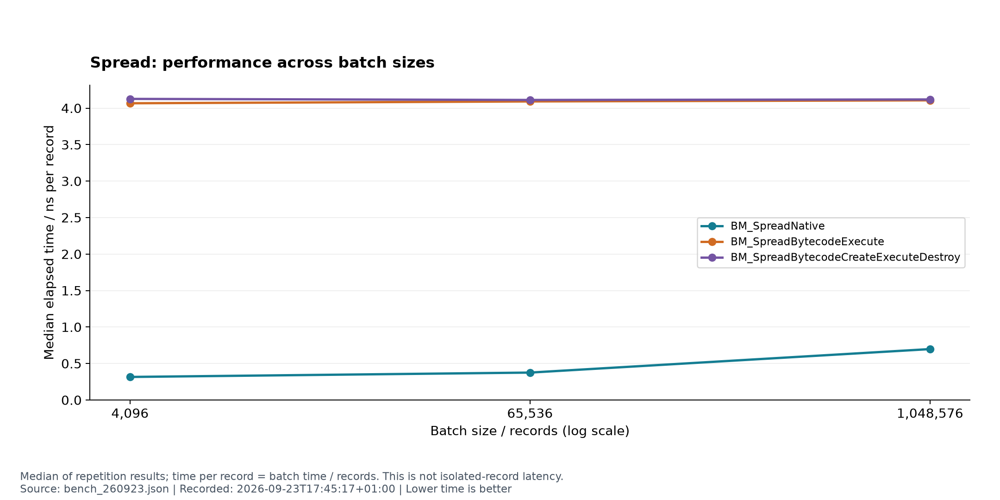
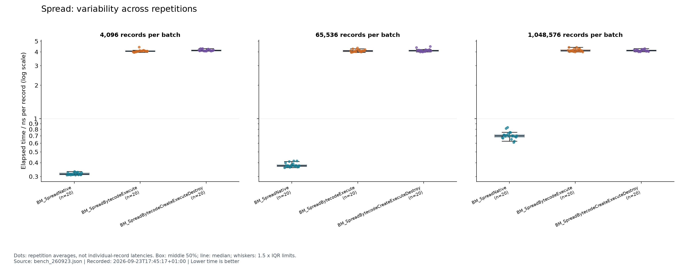
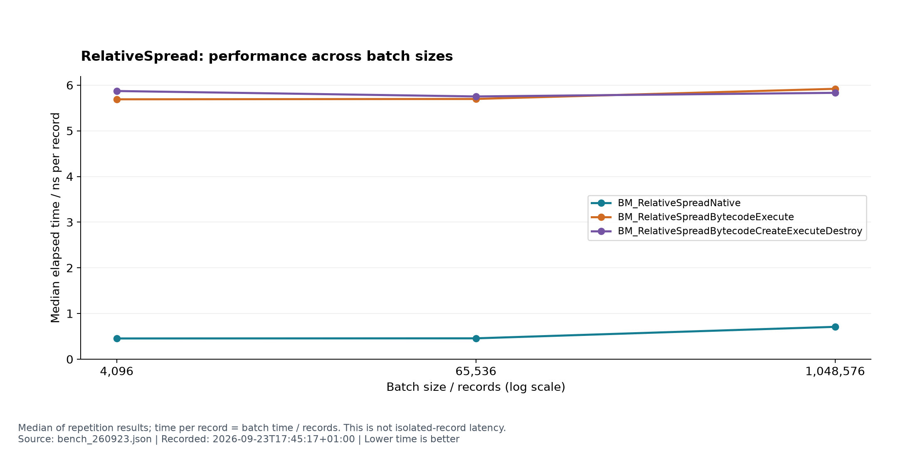
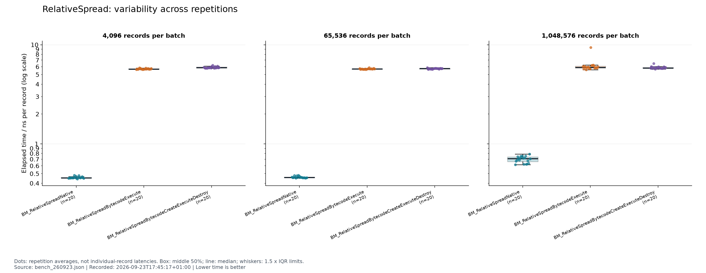
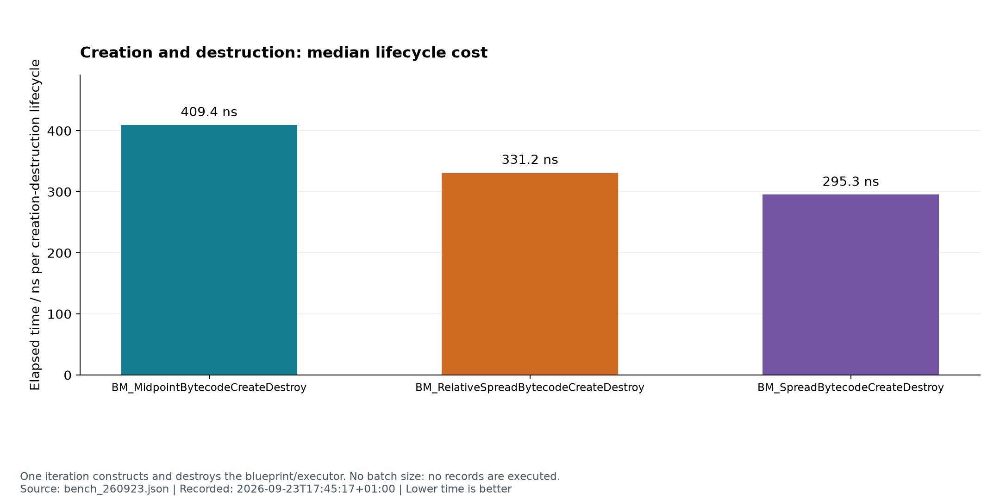
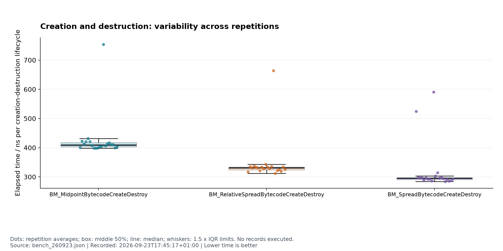

# FastStreamCompute

FastStreamCompute is a C++ 20 engine that prepares a numerical computation once and runs it repeatedly over input records. The goal is to get a reusable engine closer to the speed of specialised native C++, while keeping it able to run different supported expressions without changing the executor.

## Progress

The C++ builder, reference evaluator and scalar register-bytecode executor are working, with correctness tests registered in CTest. Google Benchmark compares midpoint, spread and relative spread against native C++ implementations, measuring execution and preparation separately.

The native implementations are currently faster. Next, I will profile the gap and inspect the assembly to decide what to improve in the executor.

## Benchmarks

These charts use [the 23 September 2026 Windows run](docs/benchmarks/bench_260923.json), with 20 repetitions per case. Lower times are better; each dot is a repetition average, not an individual record's latency. These are baseline measurements, not proof of performance on every workload.

### Midpoint

Bytecode execution stays near 5.4 ns per record across batch sizes.

Native midpoint results vary more at the largest batch size.

### Spread

Bytecode spread takes roughly 4.1 ns per record across batch sizes.

Bytecode spread results cluster fairly tightly across repetitions.

### Relative spread

Bytecode relative spread takes roughly 5.7–5.9 ns per record.

The largest batch includes an unusually slow bytecode execution repetition.

### Creation and destruction

Median creation and destruction costs range from about 295 to 409 ns.

All three creation benchmarks have occasional slower repetition averages.

