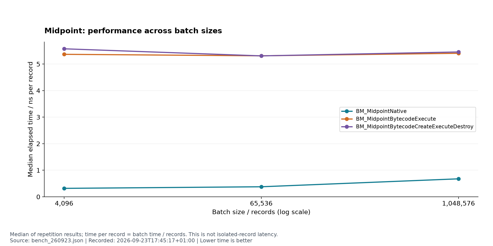
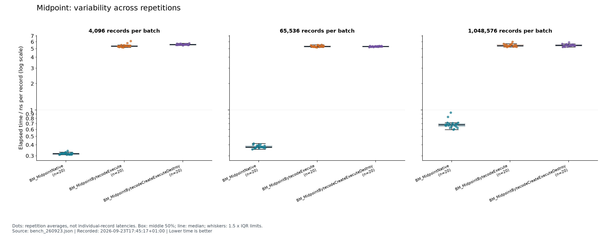
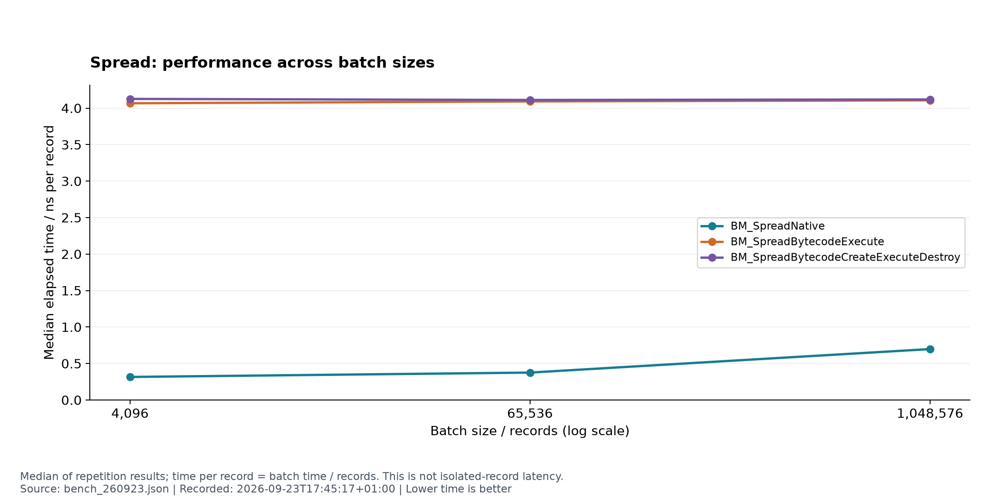
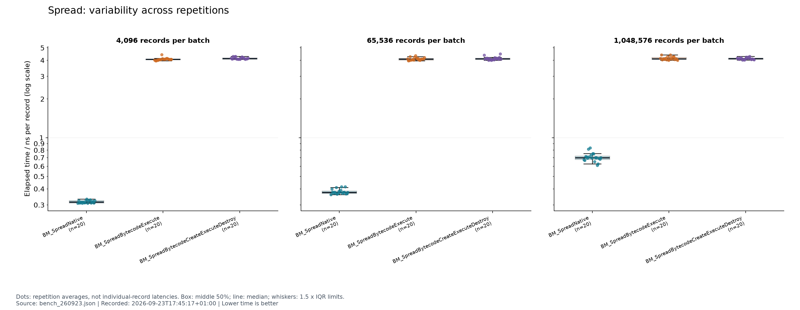
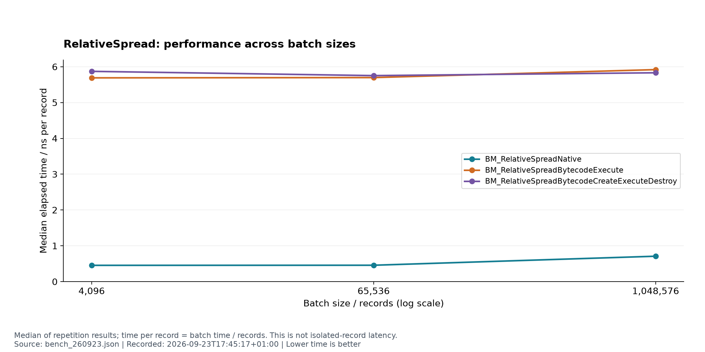
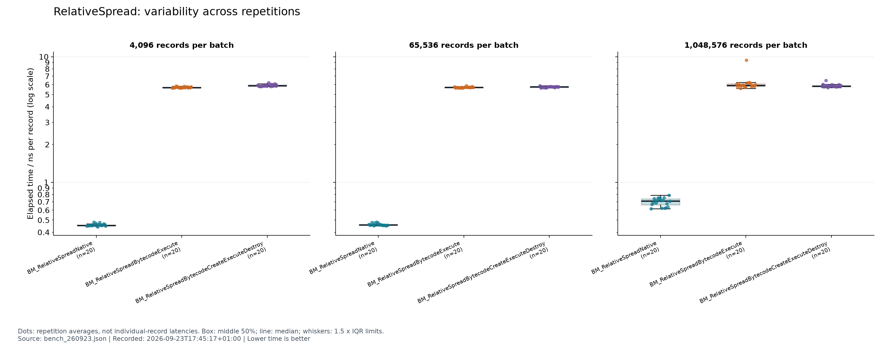
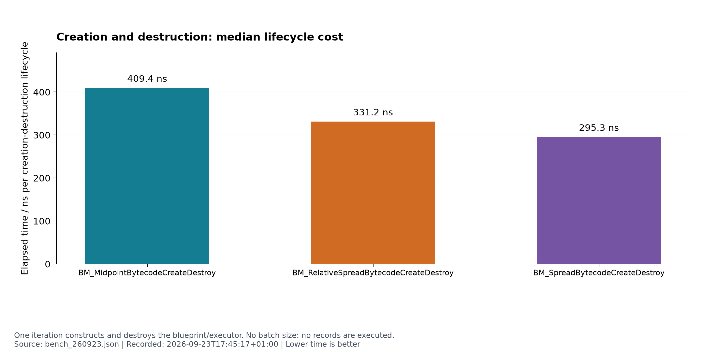
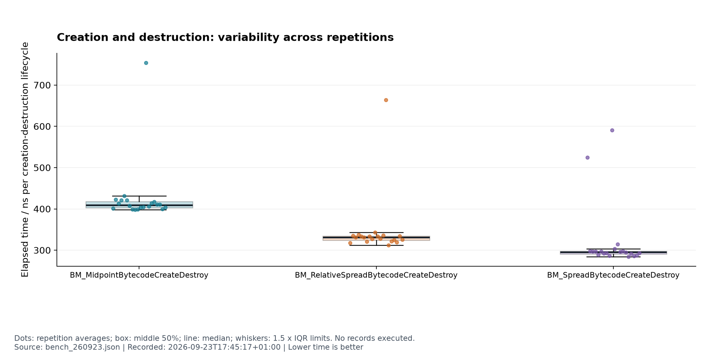

# FastStreamCompute

FastStreamCompute is a C++ 20 engine that prepares a numerical computation once and runs it repeatedly over input records. The goal is to get a reusable engine closer to the speed of specialised native C++, while keeping it able to run different supported expressions without changing the executor.

## Current Hypothesis

For Spread over 4,096 records, bytecode interpretation takes 16.9x longer, has 17.7x more instructions, executions 16.7x more instruction, but marginally has a 
higher IPC. perf record had majority of samples (80%)  inside BytecodeExecutor::execute, there I performed perf annotate to view the assembly. Initially,
I saw the native implementation using SIMD so investigated that. So, I used compiler flags "-fno-tree-loop-vectorize", "-fno-tree-slp-vectorize" and
remeasured. I found that that in this instance bytecode interpretation was only 12.2x slower. With vectorisation enabled, native executes: 28.5% fewer instructions 
and 12.8% fewer cycles. The faster version has lowe IPC so IPC alone does not mean a faster program. Surprisingly, native performance only improved by 1.17x and
bytecode performance also improved by 1.14x. However, I believe that the biggest improvement can come from bytecode executing less instructions since it has a higher 
IPC than native and runs 17.7x more instructions than native. It calculates opcodes and operands every instruction for batchExecute even if it is the same, I should
find a way to reduce this control logic. Contiguous arithmetic loops should strive to enable automatic vectorisation.

Processing 256 records per chunk reduced introduced a 7.9x speedup. Instructions reduces by 85.7% and cycles by 87.7%. The gap to native narrowed to 1.97x in these 
runs. This supports the original hypothesis. The new assemblu contains packed subtractions, showing that the compiler successfuly vectorised the chunked arithmetic 
loop. This result only covers spread at one batch size and chunk capacity.

On my Windows laptop, chunked bytecode execution with a capacity of 256 was 3.56–6.87x faster than the original executor across spread, midpoint and
relative spread, using batches from 4,096 to 1,048,576 records. An experiment at chunk size of 4,096 found the lowest median times at 1,024 records per chunk for
spread, 512 for midpoint and 64 for relative spread.This shows that larger chunks are not always better. they reduce repeated instruction handling but increase 
temporary storage, and the balance depends on the expression. I then tested the creation and destruction costs of the chunked executor which was similar to
the original bytecode executor. All existing CTest's passed.

Next I implemented graph optimisations. The three optimisations were to remove unused nodes, fold all constant expressions and CSE (common subexpression elimination).
I benchmarked them against 4,096 records and 65,536 records with chunk capacity 256 (on a program which could be optimised using all 3 optimisations); the improvents,
respectively, were 1.13x, 1.06x, 1.08x. Optimising with all 3 options produces a 1.53x speedup. The reduction of scratch storage correlates with the number of nodes
(virtual registers) reduced. The median creation and destruction cost of optimising the test program was +0.138 (1.17x) microseconds. These results describe one 
deliberately optimisable program, so they demonstrate the potential benefit of the passes rather than an expected speedup for every program.

I then attempted to find latency percentiles to check if there was any unaccounted surprising behaviour on tail ends. I compared chrono and TSC in the latency harness.
I pinned the program to logical CPU 2 using taskset and conducted 5 rounds of experiments measuring 256-record midpoint batches (as a single unit). Without individual
timestamps, chunked execution averaged about 211 ns per batch and native averaged 62 ns, so chunked took roughly 3.4 times as long. Timing every call noticeably changed
the workload: TSC increased total runtime by 14–15% for chunked and 44–48% for native, while chrono increased it by 19–20% and 69–70%. Using a sparse sampling technique
by sampling just 1% of calls with TSC kept the observed runtime difference close to 0. Chrono also returned durations in 100 ns increments on this setup, making it
too coarse to distinguish small differences in these short executions. I therefore chose sparse TSC for batch latency percentiles. The sampled chunked p50, p99 and p99.9
were consistently around 220, 239 and 289 ns, compared with 73, 76 and 96 ns for native.  Its p99 was only about 9% above its median. These percentiles give me a baseline
for checking whether future changes improve typical performance without making the slower executions worse. (TSC has a measured overhead of 14 ns and preturbation was
minimised using sparse sampling).

## Benchmarks

### Linux perf

Spread on an i7-8700T running Manjaro: 4,096 records per batch, 100,000 iterations, five runs. [Raw results](docs/bench/spread_ipc.txt).

| Measurement | Native | Bytecode |
|---|---:|---:|
| Median batch time / ns | 2,368 | 39,998 |
| Mean instructions per run / billions | 2.065 | 36.471 |
| Mean cycles per run / billions | 0.741 | 12.341 |
| Instructions per cycle | 2.79 | 2.96 |

The counters cover the whole process; batch times cover the benchmark loop. [perf report](docs/bench/spread-bytecode-report.txt) puts 80.61% of cycle samples in `BytecodeExecutor::execute`. A [separate vectorisation check](docs/bench/spread-vector-comparison.txt) found a 1.17x native speedup with vectorisation enabled, while bytecode remained 12.32x slower with it disabled in both builds. Next is measuring whether chunking reduces the repeated instruction handling.

### Windows baseline

These charts use [the 23 September 2026 Windows run](docs/bench/bench_260923.json), with 20 repetitions per case. Lower times are better; each dot is a repetition average, not an individual record's latency. These are baseline measurements, not proof of performance on every workload.

### Midpoint

Bytecode execution stays near 5.4 ns per record across batch sizes.

Native midpoint results vary more at the largest batch size.

### Spread

Bytecode spread takes roughly 4.1 ns per record across batch sizes.

Bytecode spread results cluster fairly tightly across repetitions.

### Relative spread

Bytecode relative spread takes roughly 5.7–5.9 ns per record.

The largest batch includes an unusually slow bytecode execution repetition.

### Creation and destruction

Median creation and destruction costs range from about 295 to 409 ns.

All three creation benchmarks have occasional slower repetition averages.

