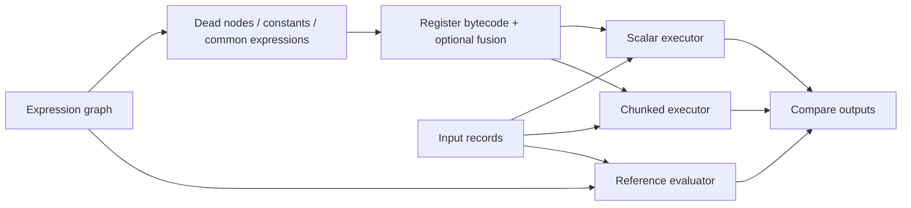
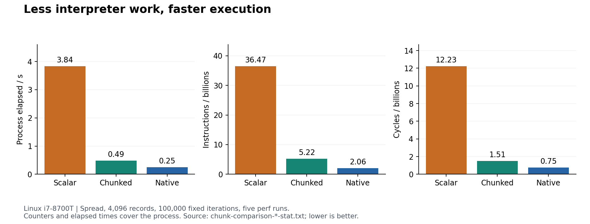
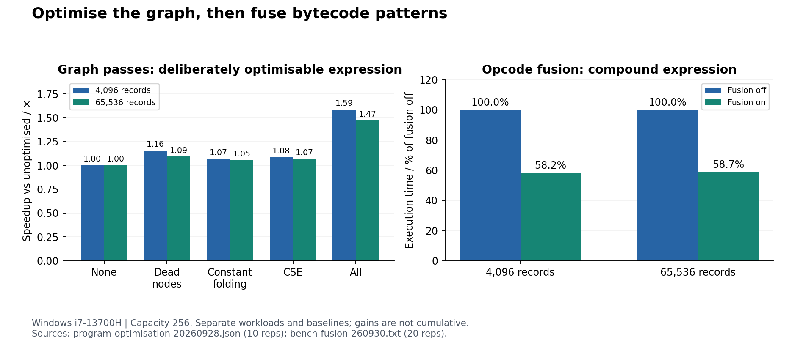
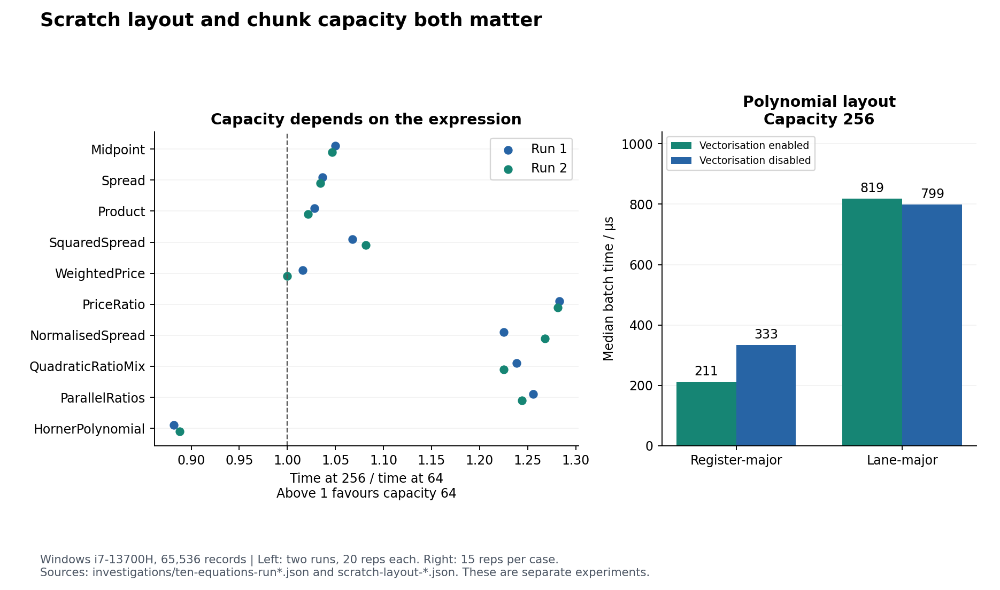
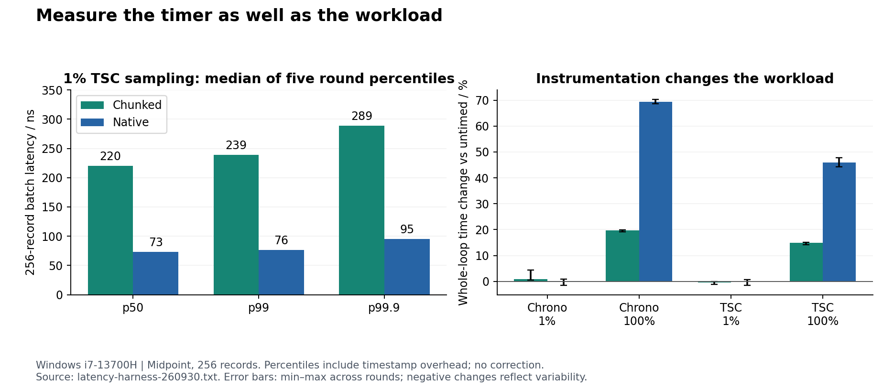
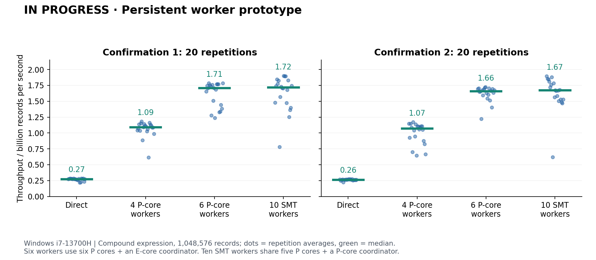
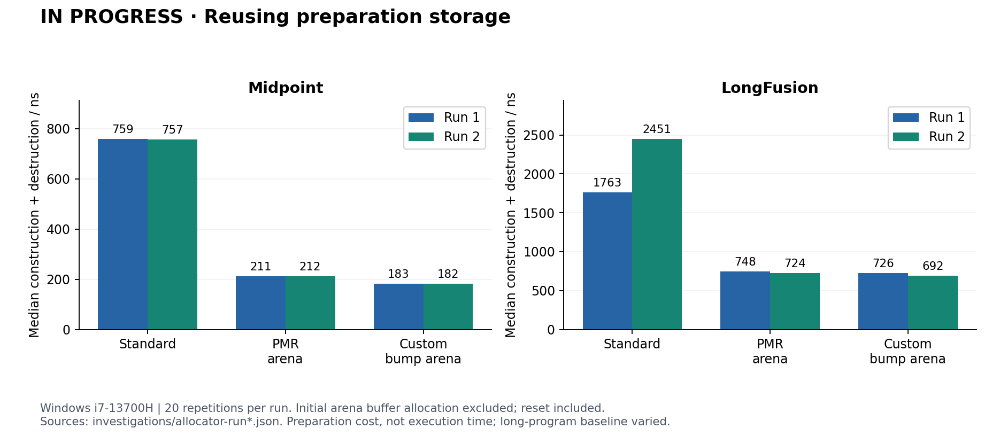

# FastStreamCompute

A C++20 engine for running numerical expressions over batches of records. Define a calculation once, prepare its bytecode, then reuse the executor with new inputs.

I built this to learn how to close the gap between a general-purpose executor and specialised native C++: find the expensive work, change the design, check the answers, and measure again. The project covers expression graphs, bytecode, compiler vectorisation, memory layout and performance measurement.

**Implemented:** graph optimisations, scalar and chunked executors, opcode fusion, multiple outputs, differential tests and a latency harness. **In progress:** integrating the multicore and allocator prototypes described below.

## Results at a glance

| Change or investigation | Measured result | Scope |
|---|---|---|
| Chunked execution | **7.9× faster, 85.7% fewer instructions** | Spread, 4,096 records; fixed-iteration Linux `perf` comparison against scalar bytecode |
| Graph optimisations | **1.47–1.59× faster** | One deliberately optimisable expression at two batch sizes; geometric mean **1.53×** |
| Four opcode-fusion patterns | **41% less execution time** | Compound expression at 4,096 and 65,536 records; fusion on versus off |
| Scratch layout | **3.87× faster** | Register-major versus lane-major storage on a polynomial workload |
| Batch latency | **239 ns p99** | One prepared 256-record midpoint batch, 1% TSC sampling; includes timing overhead |
| Multicore prototype — **in progress** | **~6.3× throughput; 1.66 billion records/s** | Million-record compound expression; six performance-core workers plus a coordinator |
| PMR arena prototype — **in progress** | **72% less preparation time** | Midpoint plan/executor construction and destruction; initial arena allocation excluded |

These results come from separate experiments and baselines. They are not cumulative speedups. Linux measurements used an **Intel i7-8700T**; Windows measurements used an **Intel i7-13700H**. The sections below link the saved data and explain what each result measures.

[Build and test](#build-and-test) · [Execution and optimisations](#execution-and-optimisations) · [Memory and cache](#memory-and-cache) · [Latency](#measuring-short-batch-latencies) · [Work in progress](#work-in-progress) · [Benchmark archive](#benchmark-archive)

## What it does

The builder creates an expression graph from double-precision inputs, constants and arithmetic operations. For example:

```cpp
using namespace faststreamcompute;

Program p;
const auto bid = p.inputf64("bid");
const auto ask = p.inputf64("ask");
p.emit("midpoint", p.mul(p.add(bid, ask), p.constant(0.5)));

const auto optimised = optimiseProgram(p);
ExecutionBlueprint blueprint(optimised);  // Fusion is enabled by default.
ChunkedBytecodeExecutor executor(blueprint, 256);

std::vector<QuoteRecord> records = {{100.0, 102.0}, {200.0, 204.0}};
std::vector<double> output(records.size());
executor.execute(records, std::span<double>(output));  // 101.0, 202.0
```

The API lives in [`program.hpp`](include/faststreamcompute/program.hpp), [`program_optimiser.hpp`](include/faststreamcompute/program_optimiser.hpp) and [`bytecode_executor.hpp`](include/faststreamcompute/bytecode_executor.hpp).


```mermaid
flowchart LR
    P[Expression graph] --> O[Dead nodes / constants / common expressions]
    O --> B[Register bytecode + optional fusion]
    B --> S[Scalar executor]
    B --> C[Chunked executor]
    R[Input records] --> S
    R --> C
    P --> V[Reference evaluator]
    R --> V
    S --> T[Compare outputs]
    C --> T
    V --> T
```

Preparation builds the plan and allocates scratch storage. Execution reuses that storage. The scalar executor handles one record at a time; the chunked executor applies each instruction to several records before moving to the next instruction. Its contiguous arithmetic loops let the compiler generate SIMD instructions.

The engine supports addition, subtraction, multiplication, division and named outputs. Input records currently contain `bid` and `ask`; this is a small numerical engine, not a trading strategy or a full language compiler.

## Correctness first

The [CTest suite](tests) compares execution with a straightforward reference evaluator and exercises empty inputs, invalid operands and output sizes, multiple outputs, partial chunks, executor reuse, graph optimisations and fusion. This catches errors such as handling a full chunk correctly but failing on the final few records.

**Latest verification: all nine CTest targets passed**, with a fresh GCC 16.2 Release build on Windows. Benchmarks also check outputs before and after timing. Passing these tests is evidence for the cases covered, not a claim of exhaustive verification.

## Execution and optimisations

### Removing repeated interpreter work

The initial Linux profile put **80.61% of cycle samples inside `BytecodeExecutor::execute`**. Scalar bytecode retired far more instructions than native C++, even though its instructions-per-cycle figure was slightly higher. Higher IPC alone did not mean a faster program.

I first disabled compiler vectorisation in both implementations. Native spread improved by about **1.17×** when vectorisation was enabled, but scalar bytecode was still **12.32× slower** with it disabled in both builds. That made repeated instruction handling a better target than assuming SIMD explained the whole gap.

Chunking reduced how often the executor decodes the same instruction for successive records. In the fixed-iteration comparison it reduced elapsed time by **7.9×**, instructions by **85.7%** and cycles by **87.7%**. It remained about **1.97× slower than native C++**. The chunked assembly contains packed subtraction (`subpd`), confirming automatic vectorisation. The speedup includes both the execution-design change and the compiler optimisations it enables.



*Spread, 4,096 records, capacity 256, 100,000 benchmark iterations per process, five `perf stat` runs. The counters and elapsed times above cover the whole process.*

Evidence: [scalar counters](docs/bench/chunk-comparison-bytecode-stat.txt), [chunked counters](docs/bench/chunk-comparison-chunked-stat.txt), [native counters](docs/bench/chunk-comparison-native-stat.txt), [profile](docs/bench/spread-bytecode-report.txt), [chunked assembly](docs/bench/spread-chunked-annotate.txt), [SIMD on/off comparison](docs/bench/spread-vector-comparison.txt).

A separate Windows sweep found **3.56–6.87× faster chunked execution** across spread, midpoint and relative spread, from 4,096 to 1,048,576 records at capacity 256. [Execution results](docs/bench/chunk-execution-results.json) and [preparation results](docs/bench/chunk-lifecycle-results.json) keep the two costs separate.

### Optimising the graph and fusing bytecode

The graph optimiser removes dead nodes, folds constant expressions and eliminates common subexpressions. On the deliberately optimisable test program, all three passes reduced the graph from **12 to 7 registers** and scratch from **24,576 to 14,336 bytes** at capacity 256.

| Records | Unoptimised / µs | All three passes / µs | Speedup |
|---|---:|---:|---:|
| 4,096 | 6.258 | 3.944 | 1.59× |
| 65,536 | 103.758 | 70.568 | 1.47× |

The geometric mean of those two speedups is **1.53×**. Preparation and destruction increased from **836 to 974 ns**, approximately **138 ns**. These are historical measurements from before opcode fusion was added; they demonstrate the graph passes on an expression designed to exercise them.

Fusion then recognises four bytecode patterns: `(a + b) * k`, `(a - b) * k`, `a * b + k`, and `(a - b) / c`. Unmatched instructions use the general executor. Use counts prevent fusion from discarding an intermediate value needed elsewhere. Fusion does not enable floating-point FMA contraction.



*The two panels use different workloads and baselines. The saved graph-pass experiment has 10 repetitions; the fusion experiment has 20 randomly interleaved repetitions.*

Fusion reduced compound-expression execution time from **21,749 to 12,651 ns** at 4,096 records and **363,246 to 213,206 ns** at 65,536 records: about **41% less time** at both sizes. The smaller batch saved **9,098 ns** per execution for approximately **75 ns** extra plan/executor construction and destruction, recovering that cost on its first execution. Preparation measurements were noisier, so 75 ns is an estimate of the lifecycle difference, not a precise measurement of the fusion loop.

Sources: [graph-pass results](docs/bench/program-optimisation-20260928.json), [fusion results and variability](docs/bench/bench-fusion-260930.txt).

## Memory and cache

### Contiguous scratch values

Scratch uses **register-major storage**: all lanes of one virtual register are consecutive, at `scratch[register * capacity + lane]`. That matches the inner loop, which processes one operation across consecutive records.

I compared this with lane-major scratch, where all registers for one record are grouped together. On a 30-register polynomial at capacity 256, register-major took **211.5 µs**, versus **819.0 µs** for lane-major: **3.87× faster**. Consecutive lanes are 8 bytes apart in the current layout and 240 bytes apart in the alternative. A 64-byte cache line can hold eight consecutive doubles.

This compares intermediate-value storage; the input `QuoteRecord` array remains AoS. It is not a measured migration of the input records to SoA. The advantage also persisted with vectorisation disabled, but no hardware cache-hit/miss counters were collected, so I do not attribute the entire gain to cache misses.

### A larger chunk is not automatically better

My initial hypothesis was to bring scratch allocation close to the **48 KiB L1 data cache** on the pinned performance core. Across ten expressions, capacity **64** beat **256** in eight cases, with one near tie and one loss. Scratch occupied only about **4–31% of L1** at capacity 64. The polynomial preferred 256.



*65,536 input records on the Windows laptop. The capacity plot shows both runs rather than hiding the near tie; the layout plot compares one polynomial with automatic vectorisation enabled and disabled.*

Controlled scheduling experiments kept scratch pitch fixed and used equal fence counts. A division workload took **87.0 versus 112.9 µs** with the two loop schedules; with `LFENCE` restricting execution overlap, the times converged to **135.4 and 135.6 µs**. This supports a contribution from out-of-order execution and instruction-level parallelism. It does not identify a single CPU resource as the cause or establish one optimal capacity for all programs.

A separate producer/consumer experiment investigated temporal locality: processing values in 64-element tiles reduced time by about **39%** for 8 MiB and 64 MiB working sets. That was a synthetic experiment, not another 39% engine speedup. The executor already consumes chunk intermediates soon after producing them.

Evidence: [capacity run 1](docs/bench/investigations/ten-equations-run1.json), [run 2](docs/bench/investigations/ten-equations-run2.json), [scratch layout](docs/bench/investigations/scratch-layout-vectorised.json), [scalar layout control](docs/bench/investigations/scratch-layout-scalar.json), [scheduling controls](docs/bench/investigations/schedule-controls.json), [temporal locality](docs/bench/investigations/temporal-locality.json).

### Do explicit intrinsics help?

I also compared compiler-generated AVX2 with handwritten AVX2 arithmetic loops in a separate experiment. Manual intrinsics did not show a repeatable advantage; some rankings reversed between runs. Automatic AVX2 was promising, but the measurements were noisy. The project keeps ordinary C++ loops until a repeatable benefit justifies the extra code. [Investigation notes](docs/bench/investigations/intrinsics-notes.txt), [first run](docs/bench/investigations/intrinsics-run1.json), [confirmation](docs/bench/investigations/intrinsics-run2.json).

## Measuring short batch latencies

The [latency harness](bench/bench_latency_harness.cpp) compares `std::chrono::steady_clock` with fenced TSC timestamps. It measures an empty timing boundary, then compares untimed execution, timing every call, and randomly sampling 1% of calls. Sampling and result storage are prepared outside the measured loop.

For **one 256-record midpoint batch**, pinned to logical CPU 2 on Windows, I ran 10 million executions per mode over five rounds. Without individual timestamps, the loop averaged about **211 ns per chunked batch** and **62 ns per native batch**.

| 1% TSC sampling | p50 / ns | p99 / ns | p99.9 / ns |
|---|---:|---:|---:|
| Chunked executor | 220 | 239 | 289 |
| Native midpoint | 73 | 76 | 95 |

These are the medians of the five round percentiles, not percentiles pooled from all rounds. Each round contains 100,000 sampled batches. **A batch is the complete set of 256 records; these are not individual-record latencies.**



The empty TSC boundary had a **13.7 ns median**. Chrono returned durations in 100 ns steps on this setup; its empty-boundary median of zero reflects that granularity, not a free clock read.

Timing every call increased total loop time by **14–15% with TSC** and **19–20% with chrono** for chunked execution; the smaller native workload was affected more. The 1% TSC runs had whole-loop differences close to zero, which supports sparse sampling for this experiment. It does not prove zero perturbation or independent clock accuracy. Percentiles include timing overhead; no overhead was subtracted and no outliers were removed. This is a prepared, sequential workload without queueing under external load.

[Full latency results](docs/bench/latency-harness-260930.txt). Earlier [WSL measurements](docs/bench/chrono-wsl-run5.txt) showed substantial variability and are not the source of the Windows percentile table.

## Work in progress

The following results come from **separate prototypes**. Multicore execution and PMR are **not yet integrated into the engine**. The saved data is available here; the disposable prototype source was removed after the experiments, so these runs cannot yet be reproduced from this checkout alone.

### Persistent multicore workers — in progress

The prototype uses persistent C++20 `std::jthread` workers, private executor scratch and disjoint output regions. The caller publishes work through acquire/release synchronisation and waits for every worker. The fast variant spins while idle, which consumes CPU and power; sleeping workers were also tested and had higher handoff costs for these small jobs.

I swept **1–19 workers** across three CPU placements, then repeated the leading configurations twice with 20 randomly interleaved repetitions. Each invocation processes **1,048,576 records** using the compound expression, fusion and capacity 256. Timing includes dispatch and completion, while worker creation is outside the loop.

| Configuration | Confirmation 1 / µs | Confirmation 2 / µs | Speedup vs direct |
|---|---:|---:|---:|
| Direct single thread | 3,854 | 3,958 | 1× |
| Four performance-core workers + coordinator | 962 | 978 | 4.01–4.05× |
| Six performance-core workers + efficiency-core coordinator | 614 | 632 | **6.26–6.28×** |
| Ten SMT workers sharing five performance cores + performance-core coordinator | 610 | 627 | 6.31–6.32× |

Six workers reached **1.66–1.71 billion records/s**. I prefer that configuration for this prototype: ten SMT workers were less than 1% faster on the larger batch, with substantially higher variability, and their ranking reversed at the smaller batch size. Six is a measured design choice, not a universal optimum.



*Each dot is a benchmark repetition average, not a per-call latency sample. Six workers use six physical performance cores plus a separate efficiency core for coordination.*

Small jobs did not always benefit: in the earlier sweep, a 256-record midpoint took **0.214 µs directly versus 0.490 µs with four spinning workers**. An initial 65,536-record latency test observed a **73–85 µs p99** range for the compound expression on four spinning workers, but timing-control variability prevents treating that as a validated unperturbed tail-latency result.

The prototype passed reference checks for all worker counts, uneven partitions and changed-input reuse. Padded control fields and aligned partition boundaries address likely false-sharing sites, but hardware false-sharing counters and ThreadSanitizer have not yet validated the implementation. Equal partitions also leave room for better work distribution across performance and efficiency cores.

Sources: [worker sweep](docs/bench/investigations/multicore-discovery.json), [confirmation 1](docs/bench/investigations/multicore-confirmation1.json), [confirmation 2](docs/bench/investigations/multicore-confirmation2.json), [methodology](docs/bench/investigations/multicore-notes.txt), [earlier worker and latency experiments](docs/bench/investigations/prototype-notes-20260930.txt).

### Preparation allocations — in progress

The executor already reuses its storage during execution. This experiment targets **preparation**, comparing standard allocation, PMR backed by the general heap, a reusable `std::pmr::monotonic_buffer_resource`, and a small custom bump arena.

For midpoint, preparation made **14 logical allocation requests**. A reused arena served those requests without individual heap allocations during each measured lifecycle. The arena's initial buffer allocation was outside timing; object construction, scratch initialisation, destruction and reset were included.

| Midpoint preparation + destruction | Run 1 / ns | Run 2 / ns |
|---|---:|---:|
| Standard allocation | 759 | 757 |
| Reused PMR arena | 211 | 212 |
| Reused custom bump arena | 183 | 182 |

That is approximately **72% less preparation time with PMR** and **76% less with the custom arena**. PMR backed by the general heap did not improve the first run; the allocation strategy and reuse produced the benefit, not the PMR interface alone.



The compound-expression baseline varied more between runs, so I use the repeatable midpoint result as the headline. These are preparation savings, not hot-loop speedups. Resetting an arena invalidates its allocations: all objects must be destroyed first. The custom arena also checked alignment and bounded-buffer exhaustion. Those lifetime constraints need to be made explicit when the feature is integrated.

Sources: [run 1](docs/bench/investigations/allocator-run1.json), [run 2](docs/bench/investigations/allocator-run2.json), [allocation counts and method](docs/bench/investigations/prototype-notes-20260930.txt).

## Build and test

Requires CMake 3.20+, a C++20 compiler and standard library with `std::format` support. The current Windows build was checked with GCC 16.2 through MSYS2 UCRT64. Use a compiler-equipped terminal; Ninja is an optional build-tool choice.

```sh
cmake -S . -B build/release -DCMAKE_BUILD_TYPE=Release -DFSC_DOWNLOAD_FLAMEGRAPH=OFF
cmake --build build/release --config Release --parallel
ctest --test-dir build/release -C Release --output-on-failure
```

`FSC_DOWNLOAD_FLAMEGRAPH=OFF` skips the optional tool download for a basic build. `BUILD_TESTING` defaults to on. The CMake targets are `faststreamcompute_core`, `faststreamcompute`, and the nine test executables.

### Benchmarks

Google Benchmark v1.9.5 is downloaded at a pinned commit when `FSC_BUILD_BENCHMARKS=ON`; the first configuration needs Git and network access. For GCC/Clang with a single-configuration generator such as Ninja:

```sh
cmake -S . -B build/bench -G Ninja -DCMAKE_BUILD_TYPE=Release -DFSC_BUILD_BENCHMARKS=ON -DFSC_DOWNLOAD_FLAMEGRAPH=OFF -DCMAKE_CXX_FLAGS_RELEASE="-O3 -DNDEBUG -fno-fast-math -ffp-contract=off"
cmake --build build/bench --parallel
./build/bench/faststreamcompute_bench --benchmark_filter=Fusion --benchmark_min_time=0.1s --benchmark_repetitions=20 --benchmark_enable_random_interleaving=true --benchmark_display_aggregates_only=true --benchmark_out=docs/bench/my-fusion-results.json --benchmark_out_format=json
```

On Windows, the executable has an `.exe` suffix. With Visual Studio generators, use the appropriate `Release` executable directory and MSVC flags instead of the GCC/Clang flag string above.

`-O3` enables optimisation. `-DNDEBUG` selects release assertions. `-fno-fast-math` avoids relaxed floating-point assumptions, and `-ffp-contract=off` prevents fused multiply-add contraction from changing rounding. Compare builds with the same flags and inputs. The optimiser uses the same floating-point environment as execution but does not preserve floating-point exception flags.

The suite separates native, scalar and chunked execution from construction/destruction and combined lifecycles. A benchmark repetition contains many executions; its average is not a latency percentile. Stored runs are historical snapshots, so current code may produce different results.

### Latency and Linux profiling

`faststreamcompute_latency` is built alongside benchmarks on supported x86-64 GCC/Clang Linux or MinGW builds. It uses fixed settings in `main`, including the 256-record midpoint workload. It needs a usable CPUID-reported TSC frequency; WSL may not expose one. Pin the process to one allowed logical CPU externally. There is no automatic pinning or migration check in the harness.

On Linux, for a CPU numbered 2 that is available to the process:

```sh
taskset -c 2 ./build/bench/faststreamcompute_latency
```

Linux `perf stat` counts events, `perf report` locates sampled functions, and `perf annotate` relates samples to assembly. The stored [reports and annotations](docs/bench) were used to investigate the execution path. For a new call-stack profile, add `-g` to the release flag string above and rebuild; it retains debug information for source/assembly mapping while keeping optimisation enabled. Then:

```sh
perf record -e cycles:u -F 999 --call-graph dwarf -o docs/bench/fusion.data -- taskset -c 2 ./build/bench/faststreamcompute_bench --benchmark_filter='^BM_LongFusionChunkedBytecodeExecuteFusionOn/65536/256/real_time$' --benchmark_min_time=3s
```

Here `cycles:u` samples user-space cycles, `-F 999` requests about 999 samples/s, and `--call-graph dwarf` records stack data. Keep the matching executable and debug information available when decoding the profile. CPU affinity limits migration; it does not isolate the core from the OS or other programs.

CMake can download Brendan Gregg's FlameGraph scripts with `FSC_DOWNLOAD_FLAMEGRAPH=ON` (the project default). They go into `build/_deps/flamegraph-src`. With Linux `perf`, Perl and decoded stacks available:

```sh
bash scripts/generate_flamegraph.sh docs/bench/fusion.data docs/bench/graphs/fusion.svg
```

The old `.data` captures did not produce useful multi-level flame graphs, so I have retained their useful report/annotate output rather than present a one-bar SVG as a completed analysis. A fresh call-stack capture is still needed.

## Benchmark archive

Raw results are in [`docs/bench`](docs/bench); [`investigations`](docs/bench/investigations) contains the saved side-experiment data. The narrative [hypothesis log](docs/bench/hypothesis.txt) records the project's development; this README uses the corrected comparisons from the underlying measurements.

The six new figures can be regenerated from the saved data without running any benchmarks:

```sh
python -m pip install matplotlib
python scripts/plot_findings.py
```

The original plotting script remains available for the older native/scalar suite: `python scripts/plot_benchmarks.py docs/bench/bench_260923.json`.

<details>
<summary>Original Windows baseline: eight charts from 23 September 2026</summary>

These are the original native/scalar results, before chunking and later optimisations. Each variability dot is one repetition average; the dataset has 20 repetitions per case. They are not current engine results or per-record tail-latency distributions. [Source JSON](docs/bench/bench_260923.json).

#### Midpoint

Execution time per record stays fairly steady across the tested batch sizes.


The largest native batch shows more variation between repetitions.


#### Spread

The native kernel exposes the original scalar interpreter's overhead.


Most scalar-bytecode repetition averages cluster closely together.


#### Relative spread

The division workload has a different balance of arithmetic and interpreter costs.


One large-batch repetition is noticeably slower than the others.


#### Construction and destruction

Preparation is measured separately from repeated execution.


Occasional slow repetitions show why a single timing is insufficient.


</details>

## Next

- Integrate persistent workers, with a single-thread path for small batches, then repeat correctness, scaling and tail-latency checks.
- Integrate a PMR preparation option with explicit resource ownership and lifetime rules; keep the standard allocator as a baseline.
- Capture useful call stacks and investigate cache/false-sharing counters on suitable hardware.
- Revisit explicit SIMD, PGO and unrolling only with repeatable evidence. Generic-programming refinements and JIT compilation remain later work.
